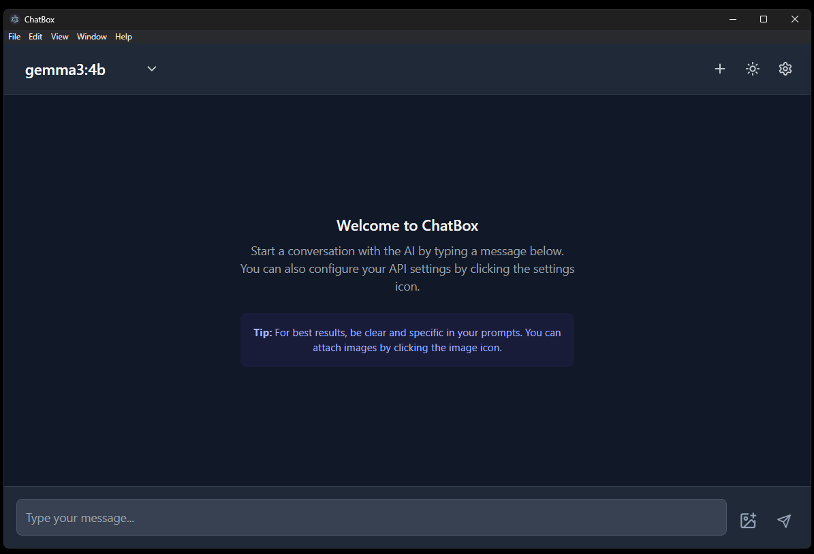
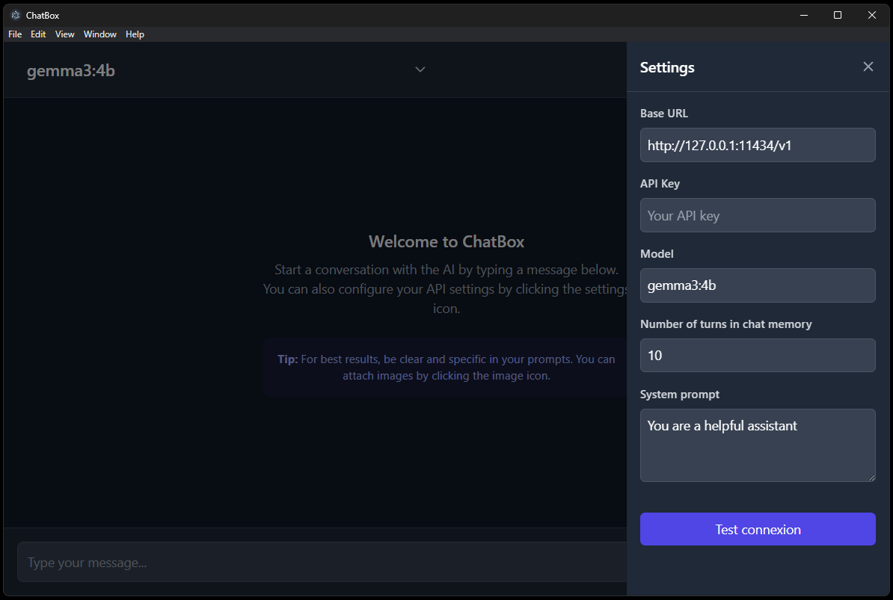
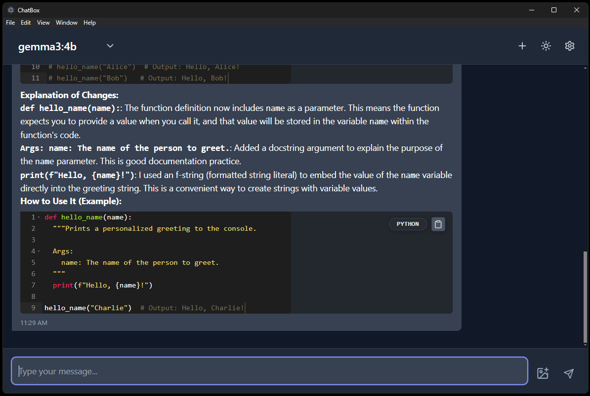
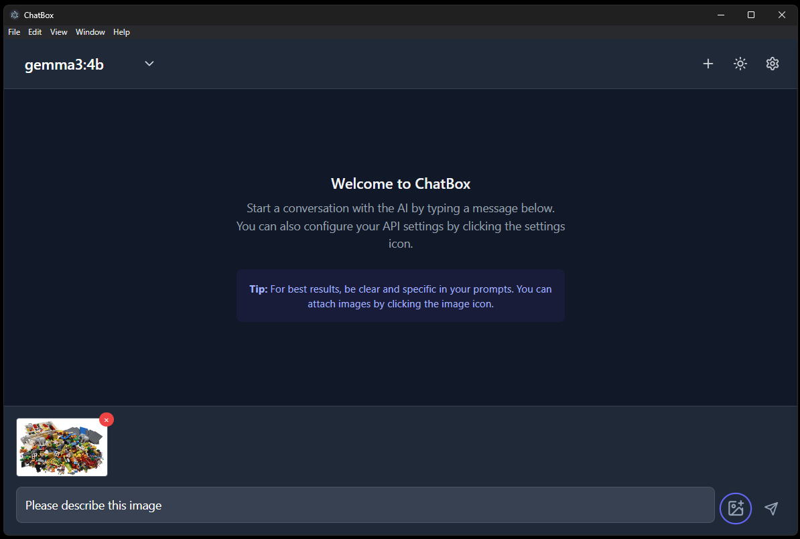
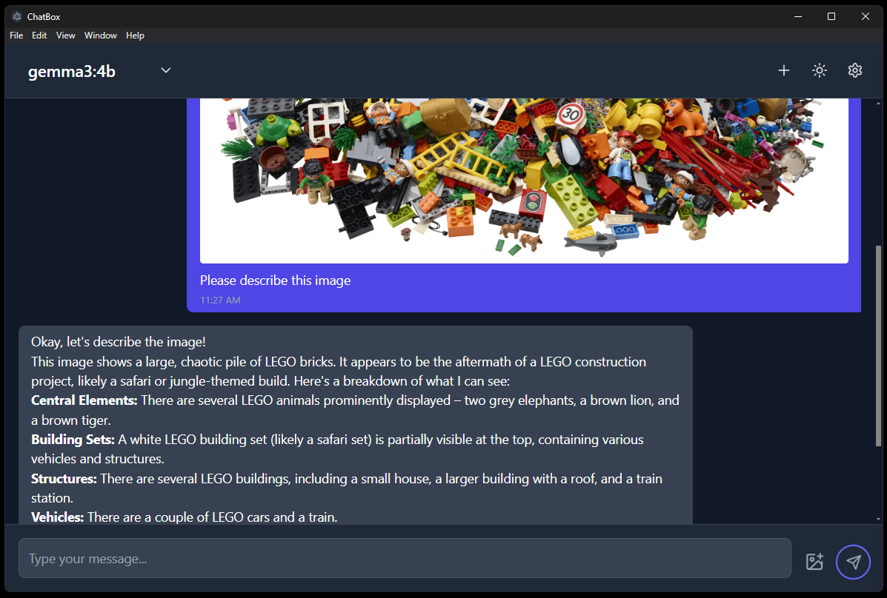
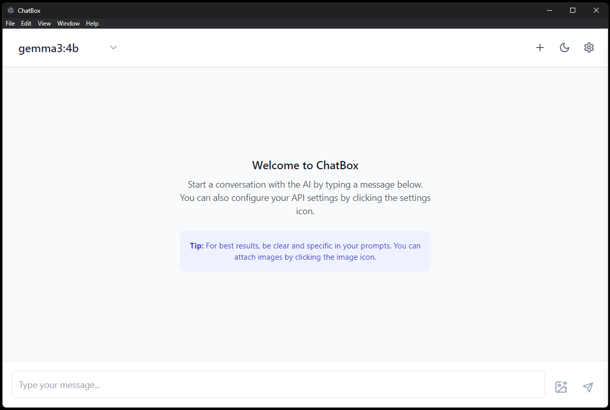

# ChatBox

A modern, cross-platform desktop chat application for interacting with LLMs (Large Language Models) via a local or remote API. Built with Electron, React, and Vite for a fast, beautiful, and extensible experience.

---

## 📥 Download

Pre-compiled releases are available at:
[Releases](https://github.com/alfredwallace7/chatbox/releases)

---

## ✨ Features

- **Multi-Model Support:**
  - Easily select from available models (supports OpenAI/Ollama-style endpoints).
- **Settings Drawer:**
  - Configure API base URL, API key, model, chat memory, and system prompt.
  - "Test connexion" button instantly checks API connectivity and shows success/error feedback.
  - Settings are automatically saved to localStorage.
- **Chat Experience:**
  - Modern, responsive UI with dark/light mode toggle.
  - Animated typing indicator (three dots) in AI chat bubble.
  - Autoscroll that pauses if you scroll up and resumes at the bottom.
  - Send messages with text and images (if supported by backend).
  - Stop button to abort streaming responses.
- **Code Blocks:**
  - Syntax-highlighted code blocks with language detection.
  - Always-visible copy button for code.
  - Language pill shown on code blocks.
- **Accessibility & UX:**
  - Thin, styled scrollbars.
  - Focus prompt at startup.
  - Keyboard and screen reader friendly.

---

## 📸 Screenshots













---

## 🛠️ Tech Stack

- **Electron**: Desktop shell for Windows, macOS, and Linux
- **React**: UI framework
- **Vite**: Fast build tool and dev server
- **Tailwind CSS**: Utility-first CSS framework
- **Ace Editor**: Syntax-highlighted code blocks
- **lucide-react**: Icon library
- **TypeScript**: Type safety

---

## 🚀 Getting Started

1. **Install dependencies:**
   ```bash
   npm install
   ```
2. **Run in development:**
   ```bash
   npm run electron:dev
   ```
3. **Build for production:**
   ```bash
   npm run electron:build
   ```
   The installer will be in `dist_electron/`.

---

## 🙏 Thanks

- [OpenAI](https://openai.com/) and [Ollama](https://ollama.com/) for API inspiration
- [Ace Editor](https://ace.c9.io/) for code editing
- [lucide-react](https://lucide.dev/) for icons
- [Vite](https://vitejs.dev/) and [Electron](https://www.electronjs.org/) for the amazing developer experience
- All open-source contributors and the community!

---

## 📋 License

[MIT](./LICENSE)

---

Enjoy using **ChatBox**! If you have issues or feature requests, please open an issue or contribute.